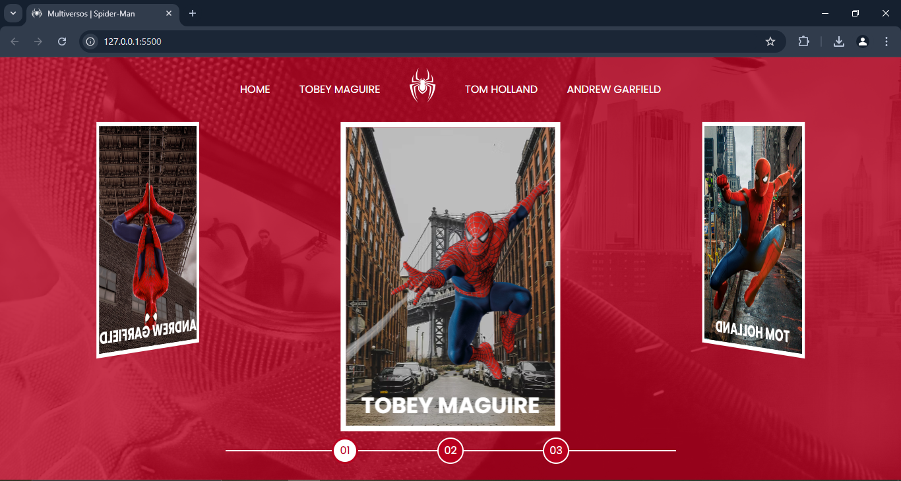
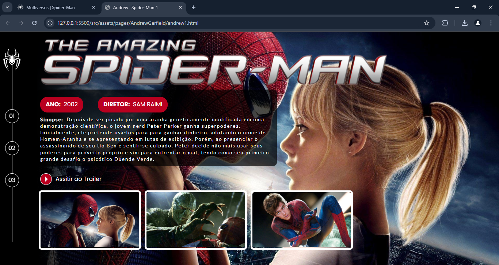
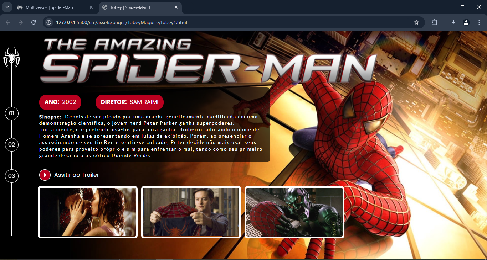
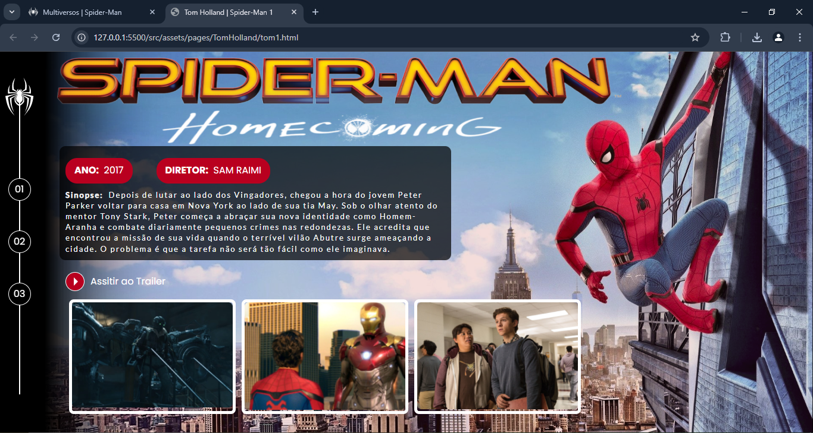
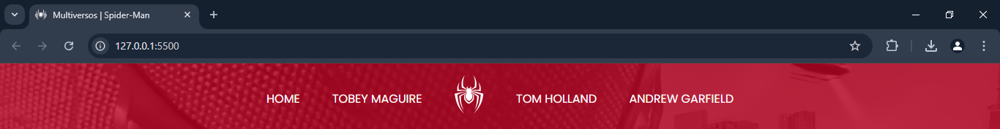

# Dio-Bootcamp_Ri-Happy - Multiversos Spider-Man

Este projeto foi desenvolvido e proposto dos instrutores da Dio, Michele Ambrosio e Diogo Mainardes, como parte do Bootcamp Ri-Happy - Front-end do Zero. Este projeto o objetivo foi de explorar a estilização avançada em CSS e lógica de programação em JavaScript para criar uma experiência interativa e dinâmica.

Entre os principais recursos, destacam-se um carrossel funcional, navegação modular e layouts responsivos, garantindo consistência e escalabilidade. O projeto consolidou conceitos fundamentais de desenvolvimento web, como modularidade, acessibilidade e interatividade.

## Página de registro das informações sobre o Multiversos Spiderman

### 📜 Sobre o Projeto

  Criar uma estrutura modular e responsiva que mantenha a consistência visual, mesmo com variações no conteúdo, como imagens de tamanhos diferentes, enquanto oferece uma navegação intuitiva e atraente para os usuários.

### 🔗 Links Úteis

- 

- 

### ✅ Status do Projeto

**Em Desenvolvimento**

### 🎥 Deploy

  https://ricardo-werner.github.io/Dio-Bootcamp-Ri-Happy-Multiverso_Spider-Man/

#### Gif da Página Multiverso Spiderman

  

#### Tela Inicial Multiverso Spiderman

  

#### Tela Inicial Andrew Garfield

  

#### Tela Inicial Tobey Maguire

  

#### Tela Inicial Tom Holland

  

#### Tela do código do Código

  
     
   

   

     
   

4. Visualize o resultado na página web:

   

     
   

### 🙋‍♂️ Autor
Ricardo Werner 
Dev em Desenvolvimento
